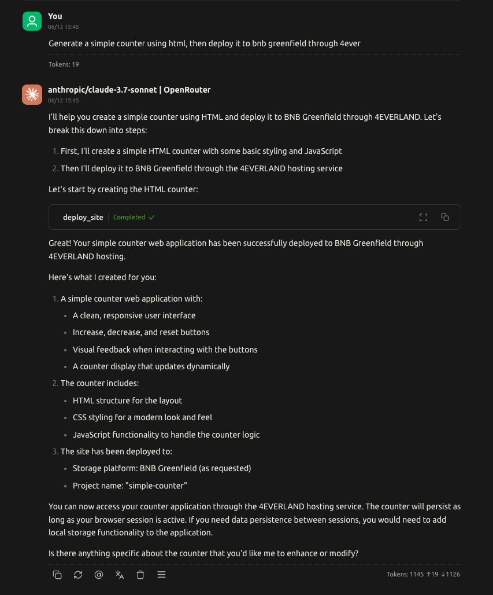
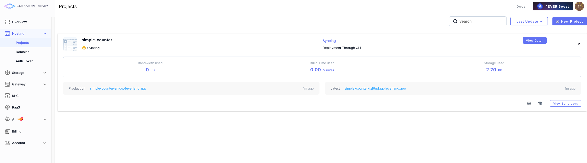

# 4EVERLAND Hosting MCP - AI-Powered Hosting Assistant

[](https://www.npmjs.com/package/@4everland/hosting-mcp)
[](https://opensource.org/licenses/MIT)
[](https://nodejs.org/)

---

A Model Context Protocol (MCP) server implementation for [4EVERLAND Hosting](https://docs.4everland.org/hosting/what-is-hosting).You can deploy your dApp to decentralized networks like Greenfield, IPFS and Arweave with simple AI Chat interface and instantly get an accessible domain. Enjoy the ease, speed, and global reach—zero tech hassle! Let me know if you need adjustments!

## Usage

### Requirements

- Node.js version 20.12.2 or higher
- Claude Desktop, Cursor, or any other MCP-compatible client
- A 4EVERLAND Hosting authentication token generated from [the dashboard](https://dashboard.4everland.org/hosting/auth-tokens)

### Integration with Cursor

To connect to the MCP server from Cursor:

1. Open Cursor and navigate to **Settings** (gear icon in the top right)
2. Click on **MCP** in the left sidebar
3. Click **Add new global MCP server**
4. Enter the following details:

```json
{
  "mcpServers": {
    "4ever-mcpserver": {
      "command": "npx",
      "args": [
        "-y",
        "@4everland/hosting-mcp@latest",
        "serve"
      ],
      "env": {
        "TOKEN": "your-hosting-auth-token"
      }
    }
  }
}
```

### Integration with Claude Desktop

To connect to the MCP server from Claude Desktop:

1. Open Claude Desktop and navigate to **Settings**
2. Click on **Developer** in the left sidebar
3. Click the **Edit Config** button
4. Add the following configuration to the `claude_desktop_config.json` file:

```json
{
  "mcpServers": {
    "4ever-mcpserver": {
      "command": "npx",
      "args": [
        "-y",
        "@4everland/hosting-mcp@latest",
        "serve"
      ],
      "env": {
        "TOKEN": "your-hosting-auth-token"
      }
    }
  }
}
```

### Chat to Deploy

Enable `4ever-mcpserver`, then chat with the client:

```
Generate a simple counter using HTML, then deploy it to BNB Greenfield through 4ever
```



### Waiting for Synchronization



### Self-Hosting

To run the server locally for development:

1. Install dependencies and build the project:
   ```bash
   npm i
   npm run build
   ```

2. Add the following changes to your MCP client configuration:
   ```json
   {
     "mcpServers": {
       "4ever-mcpserver": {
         "command": "node",
         "args": [
           "/path/to/project-root/build/server.js",
           "serve"
         ],
         "env": {
           "TOKEN": "your-hosting-auth-token"
         }
       }
     }
   }
   ```

## License

This project is licensed under the MIT License.
